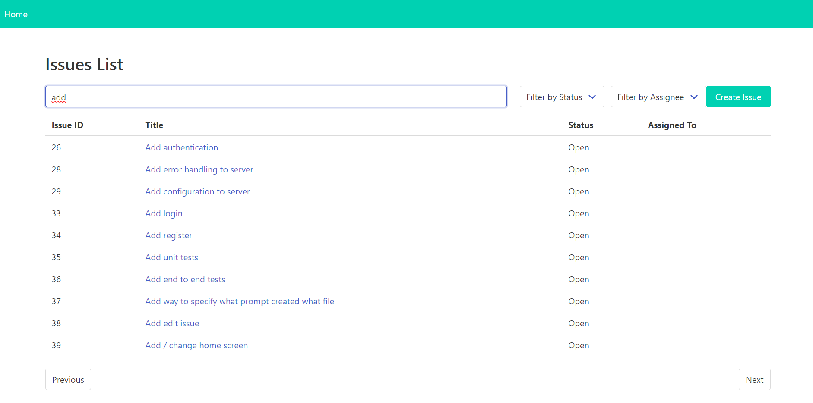
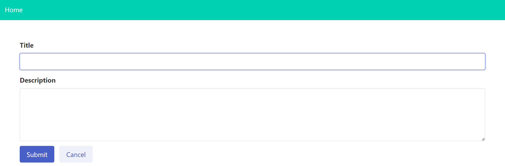

# AI Generated issue management system

Will AI replace software developers? Can AI already create a complete web application?
We created this experiment to find out, to give you a spoiler, this is a screenshot:



Unless you have checked out one of the branches, you are looking at a repository
without any code in it. There is only a README.md file and a `specifications` folder. The specifications folder contains the specifications for a non-trivial, but not overly complex web application, an issue management system. It describes usecases and detailed specifications of every page. Please note that the specifications were generated using AI and are far from perfect.

Normally a programmer would write the code and GitHub copilot helps out. 
In this experiment we will use **GitHub copilot chat** to write the code we tell it to, essentially turning it into an autopilot 🤯.

## Approach

Compared to humans, AIs have more knowledge and an almost perfect short-term memory.
They lack one important thing humans have, a long term memory where we learn.
This means we have to use short-term memory (context) to compensate for the lack of long-term memory.
Therefore, the approach we are taking in this experiment is to break up the web application into small files, where each file is generated by a prompt which contains a handful of other files as input.
Let us demonstrate what we mean.

## Phase 1: Technical documentation

The first step may sound boring: technical documentation. 
This experiment uses mongodb, so let's start by describing the mongodb documents.
A formal mongodb json schema is an option, but if we want devops engineers to be 
able to query the database, documentation in a natural language would be preferable. 
Natural language also works very well for AI, so let's do that.

### Comment document structure

Let's start with the describing the mongodb document used for the comments in our issue management system. We proceed as follows:
We start a new chat window with **Copilot chat** and copy-paste the contents of all files that are relevant. In this case we add the contents of `specifications/readme.md` and `specifications/pages/issue-details.md`. After this we add the following prompt:

```markdown
You are writing technical documentation for our web application to use as reference. 
You create short concise markdown documents that define how each document in mongodb is structured. 
You define fields, relations and custom indices. 
You use links to other documents like this: [user](user.md), [issue](issue.md), etcetera.

Create the documentation for comment documents.
```

And voila, copilot chat creates a nice document for us that we can store under `docs/database/comment.md`, it is a good reference document for humans, but it is also used as input for our next prompts.

````markdown
# Comment Document

The comment document is used to store comments made by users on issues. Each comment is associated with a specific issue and user.

## Fields

- **_id**: ObjectId - The unique identifier for the comment.
- **issueId**: Integer - The id of the issue that the comment is associated with. This is a reference to the [issue](issue.md) document.
- **userId**: ObjectId - The id of the user who made the comment. This is a reference to the [user](user.md) document.
- **text**: String - The text of the comment. This field has a maximum length of 500 characters.
- **timestamp**: Date - The date and time when the comment was posted.

## Relations

- **issue**: Each comment is associated with one issue. The `issueId` field is a reference to the [issue](issue.md) document.
- **user**: Each comment is associated with one user. The `userId` field is a reference to the [user](user.md) document.

## Indices

- **issueId**: An index is created on the `issueId` field to quickly fetch all comments associated with a specific issue.
- **userId**: An index is created on the `userId` field to quickly fetch all comments made by a specific user.

## Example

```json
{
    "_id": ObjectId("60d5ec9af682fbd12a892fe0"),
    "issueId": 1,
    "userId": ObjectId("60d5ec9af682fbd12a892fd7"),
    "text": "This is a comment on the issue.",
    "timestamp": ISODate("2021-06-25T12:00:00Z")
}
```
````

### Issue document structure

The issue document is next. We use basically the same prompt as comment, but
we now also provide the comment document we just created, so copilot chat knows
how the relation between issues and comments is structured. 
We also want this document to describe how to increment the id.
So once more we start a clean chat window, paste the files `specifications/readme.md`, `specifications/pages/issue-details.md` and `docs/database/comment` add the prompt:

```markdown
You are writing technical documentation for our web application to use as reference.
You create short concise markdown documents that define how each document in mongodb is structured. 
You define fields, relations and custom indices.
You use links to other documents like this: [user](user.md), [issue](issue.md), etcetera. 

Create the documentation for issues.
```

The response is again beautiful. We save the response to `docs/database/issue.md`.

````markdown
# Issue Document

The issue document is used to store issues reported by users. Each issue is associated with a specific user and can have multiple comments.

## Fields

- **_id**: Integer - The unique identifier for the issue. This field auto increments and is never reused.
- **title**: String - The title of the issue. This field has a maximum length of 100 characters.
- **description**: String - The description of the issue.
- **status**: String - The status of the issue. This field can have one of the following values: 'Open', 'In Progress', 'Closed'.
- **creatorId**: ObjectId - The id of the user who created the issue. This is a reference to the [user](user.md) document.
- **assigneeId**: ObjectId - The id of the user who is assigned to the issue. This is a reference to the [user](user.md) document.

## Relations

- **creator**: Each issue is associated with one user as the creator. The `creatorId` field is a reference to the [user](user.md) document.
- **assignee**: Each issue can be associated with one user as the assignee. The `assigneeId` field is a reference to the [user](user.md) document.
- **comments**: Each issue can have multiple comments. The relation is established via the `issueId` field in the [comment](comment.md) document.

## Indices

- **_id**: An index is created on the `_id` field to quickly fetch issues by their id.
- **creatorId**: An index is created on the `creatorId` field to quickly fetch all issues created by a specific user.
- **assigneeId**: An index is created on the `assigneeId` field to quickly fetch all issues assigned to a specific user.

## Example

```json
{
    "_id": 1,
    "title": "Issue title",
    "description": "This is a description of the issue.",
    "status": "Open",
    "creatorId": ObjectId("60d5ec9af682fbd12a892fd7"),
    "assigneeId": ObjectId("60d5ec9af682fbd12a892fd8")
}
```
````

I hoped the document would also include instructions on how to increment the id. My first attempt was to add `include instructions on how to determine the next _id` to the prompt. This worked perfectly a week ago in an earlier attempt, 
but somehow today it came up with a naive implementation of taking the maximum id and adding 1. 
This is a bad idea, as it leads to duplicate ids in race conditions and reuse of ids of deleted issues. This made me realize that I should stick to the approach of splitting up
everything into small files. Therefore I had **copilot chat** create a separate document describing
how to determine the next issue-id using the following prompt:
    
````markdown
You are writing technical documentation for our web application to use as reference.
You create short concise markdown documents that define how each document in mongodb is structured.
You define fields, relations and indices.
You use links to other documents like this: [user](user.md), [issue](issue.md), etcetera.

Create the documentation for determining the next _id for issues.
````

This worked perfectly and I saved the response to `docs/database/issue-next-id.md`. 
Note that response includes sample code, that should make the next steps of code generation easier.

````markdown
# Issue ID Generation

The Issue document in the issue management system uses an integer as its unique identifier (`id`), instead of the typical ObjectId used in MongoDB. This `id` is auto-incremented each time a new issue is created. This ensures that each issue has a unique `id` that is never reused.

## Fields

- **id**: Integer - The unique identifier for the issue. This field is auto-incremented each time a new issue is created.

## Auto-Incrementing the Issue ID

To auto-increment the `id` field, we use a separate MongoDB document to keep track of the last used `id`. This document is in a collection called `counters`.

The `counters` collection has a single document for issue `id` generation:

```json
{
    "_id": "issue_id",
    "seq": 0
}
```

The `seq` field stores the last used `id` for issues. When a new issue is created, we increment the `seq` field and use its value for the `id` of the new issue.

Here is a JavaScript function that performs this operation:

```javascript
async function getNextIssueId() {
    const counter = await db.collection('counters').findOneAndUpdate(
        { _id: 'issue_id' },
        { $inc: { seq: 1 } },
        { returnOriginal: false }
    );
    return counter.value.seq;
}
```

This function uses the `findOneAndUpdate` method to atomically increment the `seq` field and return the updated document. The `returnOriginal: false` option ensures that the updated document is returned, not the original one.

## Indices

- **id**: The `id` field should be indexed for faster lookup of issues.

## Relations

- **None**: The `counters` collection does not have any relations with other collections.

## Example

```json
{
    "_id": "issue_id",
    "seq": 123
}
```

This example represents the `counters` document for issue `id` generation. The `seq` field indicates that the `id` of the next issue to be created will be `124`.
````

### Comment API
We skip the other database documents for now and move on to something else interesting. 
In this experiment we are going to use a REST API between the browser and the server.
We will use formal openAPI specification documents to describe this API. 
These documents will be used by both the server and the client code. 
We start by creating a prompt for the comment API. 
We add the files `specifications/readme.md`, `specifications/pages/issue-details.md` and `docs/database/comment.md` to a new chat window and add the following prompt:

````markdown
Create the openapi document describing comment endpoints on /api/comment that these pages need 
to do queries and updates. Include details like maximum field lengths and query parameters. 
Use the same names for fields as in the mongodb document, including the _id (ObjectId).
````

The response is an openapi document that we save to `docs/api/comment.yaml`.

````yaml
openapi: 3.0.0
info:
  title: Issue Management System API
  version: 1.0.0
paths:
  /api/comment:
    get:
      summary: Get comments
      parameters:
        - name: issueId
          in: query
          description: ID of the issue to retrieve comments for
          required: true
          schema:
            type: integer
      responses:
        '200':
          description: A list of comments
          content:
            application/json:
              schema:
                type: array
                items:
                  $ref: '#/components/schemas/Comment'
    post:
      summary: Create a new comment
      requestBody:
        required: true
        content:
          application/json:
            schema:
              $ref: '#/components/schemas/Comment'
      responses:
        '201':
          description: Comment created
          content:
            application/json:
              schema:
                $ref: '#/components/schemas/Comment'
components:
  schemas:
    Comment:
      type: object
      properties:
        _id:
          type: string
          format: ObjectId
          readOnly: true
        issueId:
          type: integer
          description: The id of the issue that the comment is associated with
        userId:
          type: string
          format: ObjectId
          description: The id of the user who made the comment
        text:
          type: string
          description: The text of the comment
          maxLength: 500
        timestamp:
          type: string
          format: date-time
          description: The date and time when the comment was posted
          readOnly: true
````

Using the same technique to create the `/api/issue` endpoint unfortunately did not work.
The response left out important parameters, showing why we really need to split up everything into small files.
Let's start with a prompt to determine which endpoints we need for the issue pages.

We use a new chat window and add the contents of `specifications/readme.md`, 
`specifications/pages/issue-list.md`, `specifications/pages/issue-details.md`, `specifications/pages/create-issue.md` and `docs/database/issue.md`. Then we use the following prompt.


````markdown
Create a list of endpoints on /api/issue that these pages need to do queries and updates. 
Assume that there are already separate endpoints for all other collections.
````

The response tells us the endpoints that we will need:

````markdown
Here is a list of endpoints that would be needed for the described pages:

1. **GET /api/issue**: Fetches a list of issues. This endpoint should support query parameters for searching and filtering issues. For example, `/api/issue?status=open&assignedTo=johndoe`.

2. **GET /api/issue/{id}**: Fetches the details of a specific issue by its ID.

3. **POST /api/issue**: Creates a new issue. The request body should contain the title and description of the issue.

4. **PUT /api/issue/{id}**: Updates the details of a specific issue. The request body should contain the new status of the issue.

5. **POST /api/issue/{id}/comment**: Adds a new comment to a specific issue. The request body should contain the text of the comment.

6. **GET /api/issue/{id}/comment**: Fetches all comments for a specific issue.

These endpoints should cover all the necessary operations for the described pages. Note that the `{id}` in the URLs should be replaced with the actual ID of the issue.
````

So lets start with **GET /api/issue**. We use a new chat window and add the contents of `specifications/readme.md`, 
`specifications/pages/issue-list.md` and `docs/database/issue.md`. We then add the following prompt.

````markdown
Create the openapi document describing the GET /api/issue endpoint that this page needs. 
Include a detailed description for each query parameter.
````

The response is precisely what we need and we save this to `docs/api/issue/get.yaml`.

````yml
openapi: 3.0.0
info:
  title: Issue Management API
  version: 1.0.0
paths:
  /api/issue:
    get:
      summary: Get a list of issues
      description: This endpoint returns a list of issues. You can search for specific issues by title or description, filter issues by status or assigned user, and paginate the results.
      parameters:
        - name: search
          in: query
          description: Search for issues that contain this query in their title or description. Maximum length is 100 characters.
          required: false
          schema:
            type: string
            maxLength: 100
        - name: status
          in: query
          description: Filter issues by status. Options are 'Open', 'In Progress', 'Closed'.
          required: false
          schema:
            type: string
            enum: ['Open', 'In Progress', 'Closed']
        - name: assignedTo
          in: query
          description: Filter issues by the user they are assigned to. This should be the ObjectId of the user.
          required: false
          schema:
            type: string
            format: ObjectId
        - name: page
          in: query
          description: The page number for pagination. Page numbers start at 1.
          required: false
          schema:
            type: integer
            minimum: 1
        - name: pageSize
          in: query
          description: The number of issues to return per page for pagination. Default is 10.
          required: false
          schema:
            type: integer
            minimum: 1
            default: 10
      responses:
        '200':
          description: A list of issues
          content:
            application/json:
              schema:
                type: array
                items:
                  $ref: '#/components/schemas/Issue'
components:
  schemas:
    Issue:
      type: object
      properties:
        _id:
          type: integer
          description: The unique identifier for the issue.
        title:
          type: string
          description: The title of the issue.
        description:
          type: string
          description: The description of the issue.
        status:
          type: string
          description: The status of the issue.
        creatorId:
          type: string
          format: ObjectId
          description: The id of the user who created the issue.
        assigneeId:
          type: string
          format: ObjectId
          description: The id of the user who is assigned to the issue.
````

To endpoint **POST /api/issue** is the last one we will need for now.
We use a new chat window and add the contents of `specifications/readme.md`, 
`specifications/pages/create-issue.md` and `docs/database/issue.md`. We then add the following prompt.

````markdown
Create the openapi document describing the POST /api/issue endpoint that this page needs. 
Include a detailed description for each query parameter.
````

Which created this response that we save to `docs/api/issue/post.yaml`:

````yaml
openapi: 3.0.0
info:
  title: Issue Management API
  version: 1.0.0
paths:
  /api/issue:
    post:
      summary: Create a new issue
      description: This endpoint allows a user to create a new issue in the issue management system.
      requestBody:
        required: true
        content:
          application/json:
            schema:
              type: object
              properties:
                title:
                  type: string
                  description: A short, descriptive title for the issue. This field is mandatory. Maximum length is 100 characters.
                  maxLength: 100
                description:
                  type: string
                  description: A detailed explanation of the issue. This field is mandatory. There is no maximum length.
              required:
                - title
                - description
      responses:
        '201':
          description: Issue created successfully
          content:
            application/json:
              schema:
                type: object
                properties:
                  _id:
                    type: integer
                    description: The unique identifier for the issue. This field auto increments and is never reused.
                  title:
                    type: string
                    description: The title of the issue. This field has a maximum length of 100 characters.
                  description:
                    type: string
                    description: The description of the issue.
                  status:
                    type: string
                    description: The status of the issue. This field can have one of the following values: 'Open', 'In Progress', 'Closed'.
                  creatorId:
                    type: string
                    format: ObjectId
                    description: The id of the user who created the issue. This is a reference to the user document.
                  assigneeId:
                    type: string
                    format: ObjectId
                    description: The id of the user who is assigned to the issue. This is a reference to the user document.
        '400':
          description: Bad request. User ID must be an integer and non-empty title and description are required.
        '500':
          description: Internal server error.
````

## Phase 2: The server

Before starting to generate the server code, we decide which tools and libraries we want to use.
If you want to experiment with a different stack, you can checkout the `technical-documentation` branch and start from there.
The tools we want to be using are described by the following document that we save to `docs/server.md`.

````markdown
# Server

The server for our web application uses NodeJS with Typescript and express to provide a REST API for
the client. The server also connects to a MongoDB database to store and retrieve data using mongoose.
We also use express-validator to validate requests. We use Jest to test our application.
Passport is the library used to authenticate users using a username and password.
Users can also sign up by providing a unique username and password.

Files for the browser are served using express.static. Urls for pages all end with .html 
(example: login.html, sign-up.html).
We use strict Typescript with es6 module syntax, so use export declarations like `export const`
and `export interface`, but do not use `export default`.
Mongoose model files export a model using names like Comment and User along with a Typescript
interface prefixed with an I like IComment and IUser.
````

The next step we want is a sitemap to describe the folder structure and some main files for our web application. This is done by providing `docs/server.md` and adding the following prompt:

````markdown
Create a sitemap (a description of the folder structure and some main files for our web application) 
to add to the technical documentation. 
Specify locations for routes, mongoose models, jest testcases, demo data and scripts. 
We use src/server.ts as entry point and public/ for static files to serve.
````

This creates the following friendly response from which we append the markdown section to `docs/server.md` below a `# Sitemap` header and inside a markdown snippet.

````markdown
Here's a sitemap for your application:

```
.
├── src
│   ├── server.ts (Entry point for the application)
│   ├── routes (Contains all the route handlers)
│   │   ├── login.ts
│   │   ├── signup.ts
│   │   └── ...
│   ├── models (Contains Mongoose models and corresponding TypeScript interfaces)
│   │   ├── User.ts (Exports IUser and User)
│   │   ├── Comment.ts (Exports IComment and Comment)
│   │   └── ...
│   ├── middleware (Contains middleware functions)
│   │   ├── passport.ts (Passport authentication setup)
│   │   └── ...
│   ├── validators (Contains express-validator validation schemas)
│   │   ├── loginValidator.ts
│   │   ├── signupValidator.ts
│   │   └── ...
│   └── utils (Contains utility functions and scripts)
│       ├── demoData.ts (Script to populate the database with demo data)
│       └── ...
├── public (Contains static files to be served)
│   ├── login.html
│   ├── signup.html
│   └── ...
├── tests (Contains Jest test cases)
│   ├── login.test.ts
│   ├── signup.test.ts
│   └── ...
├── package.json (Lists package dependencies and scripts)
├── tsconfig.json (TypeScript configuration)
└── README.md (Project documentation)
```

This is a general structure and may vary based on your specific application needs. The `...` indicates that there may be other files or directories in that location.
````

Creating these folders by hand is a little bit time-consuming, so we ask copilot chat to give us the commands to create the folders mentioned in the sitemap. This time we reuse the chat window and continue the conversation with.

````markdown
Give me the commands to create the folders mentioned in the sitemap.
````

The response is a list of commands that we can execute immediately in the terminal using the **Insert into terminal** button.

```bash
mkdir -p src/routes
mkdir -p src/models
mkdir -p src/middleware
mkdir -p src/validators
mkdir -p src/utils
mkdir public
mkdir tests
```

Note that you must press ENTER in the terminal window to execute the last command. 
Also note that although the response contains `bash` commands these also work from powershell.

We continue our conversation with copilot chat for the next step.
```
Give me the npm and typescript commands needed to initialize our web application.
```

The response is again very usable, so we press the **Insert into terminal** button 
and press enter one more time to execute the last command.

````markdown
Here are the commands you need to initialize your web application:

```bash
# Initialize a new Node.js project
npm init -y

# Install TypeScript
npm install --save-dev typescript

# Initialize a new TypeScript configuration file
npx tsc --init

# Install Express
npm install express

# Install TypeScript types for Node.js and Express
npm install --save-dev @types/node @types/express

# Install other necessary libraries
npm install mongoose express-validator passport
npm install --save-dev @types/mongoose @types/express-validator @types/passport

# Install Jest for testing
npm install --save-dev jest ts-jest @types/jest

# Initialize Jest
npx ts-jest config:init
```

These commands will set up a new Node.js project with TypeScript, Express, Mongoose, express-validator, Passport, and Jest. The `--save-dev` flag is used to save packages for development purposes (like TypeScript and Jest), while the other packages are saved as regular dependencies.
````

We also need a `.gitignore` file, which we do not create ourselves of course, so we use the following prompt and save the result to our project.

````markdown
write a concise .gitignore file for this application
````

Now we can finally create the first bit of code that actually runs. We start a new chat window, copy-paste `docs/server.md` and add the following prompt:

````markdown
Create the content of src/server.ts with the specified authentication, middlewares, 
static file serving and a placeholder where to add routes later.
````

The response is a good starting point that we can save to `src/server.ts`.

````typescript
import express from 'express';
import mongoose from 'mongoose';
import passport from 'passport';
import { json, urlencoded } from 'body-parser';
import path from 'path';

// Import your passport configuration
import './middleware/passport';

const app = express();

// Connect to MongoDB
mongoose.connect('mongodb://localhost:27017/your-db-name', { useNewUrlParser: true, useUnifiedTopology: true })
  .then(() => console.log('MongoDB connected'))
  .catch(err => console.log(err));

// Middleware setup
app.use(json());
app.use(urlencoded({ extended: false }));
app.use(passport.initialize());

// Static file serving
app.use(express.static(path.join(__dirname, '../public')));

// Placeholder for routes
// TODO: Import and use your routes here

// Start the server
const port = process.env.PORT || 3000;
app.listen(port, () => console.log(`Server is running on port ${port}`));
````

The Typescript compiler immediately notices compile errors, `useNewUrlParser: true, useUnifiedTopology: true` are not recognized.
These options were for an older version of mongoose, so we manually remove them.

The next step is to have a running mongodb database. The easiest way to do this is using the following docker command:

```bash
docker run -d -p 27017:27017 --name mongodb mongo
```

So let's now try to start this server. We ask copilot chat to tell us how we need to do this:

````markdown
Tell me how to start the server. The server should auto reload changes.
````

The response is clear so we can do exactly as it says.

````markdown
To start the server with auto-reloading on changes, you can use a tool like `nodemon` which will watch your files and restart the server whenever a file changes.

First, you need to install `nodemon` as a development dependency. You can do this by running the following command in your terminal:

```bash
npm install --save-dev nodemon
```

Then, you need to add a start script to your `package.json` file that uses `nodemon` to run your server file. Assuming your server file is `src/server.ts`, you can add the following script:

```json
"scripts": {
  "start": "nodemon --watch 'src/**/*.ts' --exec 'ts-node' src/server.ts"
}
```

This script tells `nodemon` to watch all `.ts` files in the `src` directory and its subdirectories, and to use `ts-node` to execute your `src/server.ts` file whenever a file changes.

Finally, you can start your server with the following command:

```bash
npm start
```

This will start your server and it will automatically restart whenever you make changes to any `.ts` file in the `src` directory or its subdirectories.
````

The command did not work on my machine, I had to remove all single quotes in the `"start"` script to make it work.
After this it complained about the missing `import './middleware/passport'` which we have of course not created yet, so we remove this line.

### Comment routes

Now that we have got our infrastructure ready, lets implement the comment routes. 
We have documented the database and the api, so we can use these documents as input, so we provide `docs/readme.md`, `docs/server.md`, `docs/database/comment.md` and `docs/api/comment.yaml` (enclosed in a `yaml` snippet) to a new chat window and add the following prompt:

````markdown
Implement the mongoose schema and interface for comment. Include indices.
````

The response is a step by step description, followed by the file we can save to `src/models/Comment.ts`.

````typescript
import mongoose, { Document, Schema } from 'mongoose';

// Define the Comment schema
const CommentSchema = new Schema({
  issueId: { type: Number, required: true, index: true },
  userId: { type: Schema.Types.ObjectId, required: true, index: true },
  text: { type: String, required: true, maxlength: 500 },
  timestamp: { type: Date, default: Date.now },
});

// Define the Comment document interface
export interface IComment extends Document {
  issueId: number;
  userId: mongoose.Types.ObjectId;
  text: string;
  timestamp: Date;
}

// Create and export the Comment model
export const Comment = mongoose.model<IComment>('Comment', CommentSchema);
````

Now we start a new chat with the same files, add the newly created `src/models/Comment.ts` and add the following prompt:

````markdown
Give me the complete files with the implementation of this endpoint 
and the code to add to server.ts to register it.
````

The response tells us exactly what we need to do:

````markdown
To implement the endpoint for creating and fetching comments, you would need to create a new file in the `routes` directory. Let's call it `comment.ts`. 

Here's the code for `comment.ts`:

```typescript
import express from 'express';
import { body, validationResult } from 'express-validator';
import { Comment, IComment } from '../models/Comment';

const router = express.Router();

// Validation middleware for creating a new comment
const commentValidator = [
  body('issueId').isInt(),
  body('userId').isMongoId(),
  body('text').isLength({ max: 500 }),
];

router.post('/api/comment', commentValidator, async (req, res) => {
  const errors = validationResult(req);
  if (!errors.isEmpty()) {
    return res.status(400).json({ errors: errors.array() });
  }

  const { issueId, userId, text } = req.body;
  const comment: IComment = new Comment({ issueId, userId, text });

  await comment.save();

  res.status(201).json(comment);
});

router.get('/api/comment', async (req, res) => {
  const { issueId } = req.query;

  if (!issueId) {
    return res.status(400).json({ error: 'issueId query parameter is required' });
  }

  const comments = await Comment.find({ issueId });

  res.json(comments);
});

export default router;
```

Then, you would need to import this router in your `server.ts` file and use it:

```typescript
import express from 'express';
import commentRouter from './routes/comment';

const app = express();

app.use(express.json());
app.use(commentRouter);

// other middleware and routes...

app.listen(3000, () => {
  console.log('Server is running on port 3000');
});
```

This code creates two endpoints: `POST /api/comment` for creating a new comment and `GET /api/comment` for fetching comments for a specific issue. The `POST /api/comment` endpoint uses express-validator to validate the request body.
````

After verifying that /api/comment?issueId=1 returns the empty array we expected, we move on to the issue model and routes.
The model is generated using the same technique. We start a new chat window, add the files `docs/readme.md`, `docs/server.md`, `docs/database/issue.md` and `docs/api/issue.yaml` (enclosed in a `yaml` snippet) and add the following prompt:

````markdown
Implement the mongoose schema and interface for issue. Include indices. 
End every line of code with //NEWLINE
````

Copilot chat complained that the code it generated matched publicly available code and blocked the output, 
so I could not copy it anymore.
Adding the //NEWLINE instruction nicely circumvented this problem 🤫 and created the following code:

````markdown
Here is the TypeScript code to implement the Mongoose schema and interface for the Issue document. This code includes custom indices for the `_id`, `creatorId`, and `assigneeId` fields.

```typescript
import mongoose, { Document, Schema } from 'mongoose';

// Define the Issue interface
export interface IIssue extends Document {
  _id: number;
  title: string;
  description: string;
  status: string;
  creatorId: mongoose.Types.ObjectId;
  assigneeId: mongoose.Types.ObjectId;
}

// Define the Issue schema
const IssueSchema = new Schema<IIssue>({
  _id: { type: Number, required: true },  //NEWLINE
  title: { type: String, required: true, maxlength: 100 },  //NEWLINE
  description: { type: String, required: true },  //NEWLINE
  status: { type: String, required: true, enum: ['Open', 'In Progress', 'Closed'] },  //NEWLINE
  creatorId: { type: mongoose.Types.ObjectId, required: true, ref: 'User' },  //NEWLINE
  assigneeId: { type: mongoose.Types.ObjectId, ref: 'User' }  //NEWLINE
});

// Define the custom indices
IssueSchema.index({ _id: 1 });  //NEWLINE
IssueSchema.index({ creatorId: 1 });  //NEWLINE
IssueSchema.index({ assigneeId: 1 });  //NEWLINE

// Export the Issue model
export const Issue = mongoose.model<IIssue>('Issue', IssueSchema);  //NEWLINE
```
````

I had to replace the `type: mongoose.Types.ObjectId` with `type: Schema.Types.ObjectId` 
to make the code compile, but that was all.

For creating the **GET issue** route, we need to supply the files `docs/readme.md`, `docs/server.md`, `docs/database/issue.md`, `docs/api/issue/get.yaml` (enclosed in a `yaml` snippet) and the newly generated `src/models/Issue.ts` (enclosed in a `ts` snippet)

```markdown
Give me the complete files with the implementation of this endpoint 
and the code to add to server.ts to register it.
```

Then this result came out:

````typescript
import express from 'express';
import { Issue, IIssue } from '../models/Issue';

const router = express.Router();

router.get('/api/issue', async (req, res) => {
  const { search, status, assignedTo, page = 1, pageSize = 10 } = req.query;

  const query: Partial<IIssue> = {};
  if (search) {
    query.$or = [
      { title: new RegExp(search as string, 'i') },
      { description: new RegExp(search as string, 'i') },
    ];
  }
  if (status) {
    query.status = status as string;
  }
  if (assignedTo) {
    query.assigneeId = assignedTo as string;
  }

  const issues = await Issue.find(query)
    .skip((page as number - 1) * pageSize as number)
    .limit(pageSize as number);

  res.json(issues);
});

export default router;
````

The Typescript did not compile, I had to replace `Partial<IIssue>` with `any`, 
but then the code worked fine.
I forgot to ask for request validation, so when I continued the chat with:

````markdown
Add request validation
````

And then the result was complete and I could save it to `src/routes/issue.ts`:

````typescript
import express from 'express';
import { checkSchema, validationResult } from 'express-validator';
import { Issue, IIssue } from '../models/Issue';

const router = express.Router();

const validationSchema = checkSchema({
  search: {
    in: ['query'],
    isString: true,
    optional: true,
    errorMessage: 'search must be a string',
  },
  status: {
    in: ['query'],
    isString: true,
    optional: true,
    isIn: {
      options: [['Open', 'In Progress', 'Closed']],
      errorMessage: 'status must be one of: Open, In Progress, Closed',
    },
  },
  assignedTo: {
    in: ['query'],
    isString: true,
    optional: true,
    errorMessage: 'assignedTo must be a string',
  },
  page: {
    in: ['query'],
    isInt: { options: { min: 1 } },
    optional: true,
    errorMessage: 'page must be an integer greater than 0',
  },
  pageSize: {
    in: ['query'],
    isInt: { options: { min: 1 } },
    optional: true,
    errorMessage: 'pageSize must be an integer greater than 0',
  },
});

router.get('/api/issue', validationSchema, async (req, res) => {
  const errors = validationResult(req);
  if (!errors.isEmpty()) {
    return res.status(400).json({ errors: errors.array() });
  }

  const { search, status, assignedTo, page = 1, pageSize = 10 } = req.query;

  const query: Partial<IIssue> = {};
  if (search) {
    query.$or = [
      { title: new RegExp(search as string, 'i') },
      { description: new RegExp(search as string, 'i') },
    ];
  }
  if (status) {
    query.status = status as string;
  }
  if (assignedTo) {
    query.assigneeId = assignedTo as string;
  }

  const issues = await Issue.find(query)
    .skip((page as number - 1) * pageSize as number)
    .limit(pageSize as number);

  res.json(issues);
});

export default router;
````

I retried creating the route with validation using just one prompt, 
but then it started to leave out important details.
So the lesson we learned here is that creating files incrementally is actually a good approach.

For creating the **POST issue** route, we need to supply the files `docs/readme.md`, `docs/server.md`, `docs/database/issue.md`, , `docs/database/issue-next-id.md`, `docs/api/issue/post.yaml` (enclosed in a `yaml` snippet) and `src/models/Issue.ts` (enclosed in a `ts` snippet).

```markdown
Give me the complete files with the implementation of this endpoint including request validation 
and the code to add to server.ts to register it.
```

Then this end result came out:

````ts
import express from 'express';
import { body } from 'express-validator';
import { Issue, IIssue } from '../models/Issue';
import { getNextIssueId } from '../utils/issueIdGenerator';

const router = express.Router();

router.post('/api/issue', [
  body('title').isString().isLength({ max: 100 }),
  body('description').isString()
], async (req: express.Request, res: express.Response) => {
  const { title, description } = req.body;

  const issue: IIssue = new Issue({
    _id: await getNextIssueId(),
    title,
    description,
    status: 'Open',
    creatorId: req.user._id,  // assuming user is authenticated and user object is attached to the request
    assigneeId: null
  });

  await issue.save();

  res.status(201).send(issue);
});

export { router as issueRouter };
````

We merged this contents with the `src/routes/issue.ts` file and removed the `creatorId` line for now. 
Note that there is something funny here,
Copilot chat decided that we should put the next id generation into a separate utility file.
This is actually not a bad idea, so let's go ahead and do this.
We reuse the chat window to ask for the implementation using the prompt:

````markdown
give me the implementation of `issueIdGenerator`
````

Which produced this implementation

````ts
import mongoose from 'mongoose';

async function getNextIssueId() {
  const counter = await mongoose.connection.db.collection('counters').findOneAndUpdate(
    { _id: 'issue_id' },
    { $inc: { seq: 1 } },
    { returnOriginal: false, upsert: true }
  );

  return counter.value.seq;
}

export { getNextIssueId };
````

This implementation contained some Typescript errors, so we added `as any` clauses where needed.
Also the `counter.value.seq` needs to be `counter.seq`, so we corrected this.

Before moving on to the client we add some demo data to the database. We let copilot chat generate the code for this. In the following prompt we provide `docs/server.md`, `docs/database/comment.md`, `docs/database/issue.md`, `src/models/Comment.ts` and `src/models/Issue.ts` and add the following prompt:

````markdown
Create a Typescript script that adds 2 issues containing 2 comments each to the database 
using the mongoose schemas above. Hardcode all user ids with the same value for now. 
Make realistic issues about a fictional government tax application web application.
````

I have omitted the result here, but after fixing a few Typescript issues, the script worked as expected and added the demo data to the database. I also let Copilot chat create a script to initialize the counter. These scripts can be found in the `scripts` folder.

## Phase 3: The client

Before starting to generate the client, we need to decide which tools and libraries we want to use.
If you want to experiment with different technologies, you can checkout the `server` branch and start from there.
First a question. Do we actually need a developer friendly framework when Copilot chat writes all the code for us?
In this experiment we try to keep things as simple as possible, but according to our philosoply,
we must still be able to split up everything into small files. 
So I choose `htmx` as a simple library with the ability to load partial pages, 
while still being close to the plain HTML that copilot chat is familiar with.
For the CSS framework I experimented with both `bootstrap` and `tailwind`, 
but it turns out that Copilot chat creates a nicer interface out of the box using `Bulma`.
I wrote down these decisions in the document `docs/client.md`.

````markdown
# Client

We use static html files to create the frontend, 
styled using Bulma css and use vanilla javascript to load json data from the apis.
All page urls end with .html
We also use htmx to split up the html into smaller components. 
This is done using the `hx-get` and `hx-trigger="load"` attribute.
Common elements like the user-menu can be found in the public/partials/ folder.
All pages include a consistent navbar.
````

The next step is to create a sitemap to describe the urls for our web application.
This is done by providing `specifications/readme.md`, `docs/client.md` and all `specification/pages/*.md` files and adding the following prompt:

````markdown
You are writing technical documentation for our web application to use as reference. 
You create short concise markdown documents. 
Create a short "Sitemap" document that contains a list of the html files that we need
to fulfill these usecases and specify query-string parameters if applicable. 
We need it to create the navigation between pages.
````

The response is then added to `docs/client.md` for our next promts.

````markdown
# Sitemap

Here is a list of the HTML files that we need to fulfill the use cases. Each file corresponds to a specific page in the web application.

1. **index.html**: The home page of the application. No query-string parameters.

2. **issue-list.html**: The page that displays a list of all issues. Query-string parameters:
    - `search`: The search query to filter issues by title or description.
    - `status`: The status to filter issues by (Open, In Progress, Closed).
    - `assignedTo`: The user to filter issues by who they are assigned to.

3. **issue-details.html**: The page that displays the details of a specific issue. Query-string parameters:
    - `id`: The ID of the issue to display.

4. **create-issue.html**: The page that allows users to create a new issue. No query-string parameters.

5. **edit-issue.html**: The page that allows users to edit an existing issue. Query-string parameters:
    - `id`: The ID of the issue to edit.

6. **user-profile.html**: The page that displays the profile of a specific user. Query-string parameters:
    - `username`: The username of the user to display.

7. **login.html**: The page that allows users to log in. No query-string parameters.

8. **register.html**: The page that allows users to register a new account. No query-string parameters.

Please note that the `id` and `username` parameters should be properly URL-encoded to ensure that they can be correctly interpreted by the server.
````

Before creating our first page, we create a template. We use the following prompt to generate it, while providing only `docs/client.md`:
  
````markdown
Create a blank plain template.html page that can be used as a starting point for pages like
create-issue.html. It includes a navbar with a home link and a lazy loaded user menu. 
There is one placeholder where the main page content can be placed. please make the navbar stand out.
````

This is the response:

````html
<!DOCTYPE html>
<html lang="en">
<head>
    <meta charset="UTF-8">
    <meta name="viewport" content="width=device-width, initial-scale=1.0">
    <title>Template Page</title>
    <link rel="stylesheet" href="https://cdnjs.cloudflare.com/ajax/libs/bulma/0.9.3/css/bulma.min.css">
</head>
<body>
    <nav class="navbar is-primary" role="navigation" aria-label="main navigation">
        <div class="navbar-brand">
            <a class="navbar-item" href="index.html">
                Home
            </a>
        </div>

        <div class="navbar-menu">
            <div class="navbar-end">
                <div hx-get="partials/user-menu.html" hx-trigger="load" class="navbar-item">
                    <!-- User menu will be loaded here -->
                </div>
            </div>
        </div>
    </nav>

    <main>
        <!-- Main content goes here -->
    </main>

    <script src="https://unpkg.com/htmx.org@1.6.1"></script>
</body>
</html>
````

This template is looks ok and we save it to `public/template.html` for our next prompts.
Let's start by creating the `create-issue.html` page.
We start a new chat window, add the files `docs/client.md`, `public/template.html` (in an html snippet), `docs/api/issue.yml` (in a yaml snippet), `specifications/pages/create-issue.md` and add the following prompt:

````markdown
create the new-issue.html page. 
it contains inline javascript for the client side logic and interacts with the server using /api.
````

The response is actually pretty good, except that error handling is not implemented, 
but this is actually our fault, since we did not specify how to handle errors in `docs/client.md`.

````html
<!DOCTYPE html>
<html lang="en">
<head>
    <meta charset="UTF-8">
    <meta name="viewport" content="width=device-width, initial-scale=1.0">
    <title>Create New Issue</title>
    <link rel="stylesheet" href="https://cdnjs.cloudflare.com/ajax/libs/bulma/0.9.3/css/bulma.min.css">
</head>
<body>
    <nav class="navbar is-primary" role="navigation" aria-label="main navigation">
        <div class="navbar-brand">
            <a class="navbar-item" href="index.html">
                Home
            </a>
        </div>

        <div class="navbar-menu">
            <div class="navbar-end">
                <div hx-get="partials/user-menu.html" hx-trigger="load" class="navbar-item">
                    <!-- User menu will be loaded here -->
                </div>
            </div>
        </div>
    </nav>

    <main>
        <section class="section">
            <div class="container">
                <form id="create-issue-form">
                    <div class="field">
                        <label class="label" for="title">Title</label>
                        <div class="control">
                            <input class="input" type="text" id="title" name="title" required maxlength="100">
                        </div>
                    </div>

                    <div class="field">
                        <label class="label" for="description">Description</label>
                        <div class="control">
                            <textarea class="textarea" id="description" name="description" required></textarea>
                        </div>
                    </div>

                    <div class="field is-grouped">
                        <div class="control">
                            <button type="submit" class="button is-link">Submit</button>
                        </div>
                        <div class="control">
                            <button type="button" class="button is-link is-light" onclick="window.history.back()">Cancel</button>
                        </div>
                    </div>
                </form>
            </div>
        </section>
    </main>

    <script src="https://unpkg.com/htmx.org@1.6.1"></script>
    <script>
        document.getElementById('create-issue-form').addEventListener('submit', async function(event) {
            event.preventDefault();

            const title = document.getElementById('title').value;
            const description = document.getElementById('description').value;

            const response = await fetch('/api/issue', {
                method: 'POST',
                headers: {
                    'Content-Type': 'application/json'
                },
                body: JSON.stringify({ title, description })
            });

            if (response.ok) {
                window.location.href = 'issue-list.html';
            } else {
                // Handle error
            }
        });
    </script>
</body>
</html>
````



Because we disabled the `creatorId` in the routing, the page now succesfully creates new issues 🥳.

We continue by creating the `issue-list.html` page. We start a new chat window, add the files `docs/client.md`, `public/template.html`, `docs/api/issue/get.yml` (in a yaml snippet), `specifications/pages/issue-list.md` and add the following prompt:

````markdown
Before creating the issue-list.html, decide on a concise list of selectors the javascript needs to make the page interactive.
````

The response is a list of selectors. The response is merely a note that Copilot chat will
use to answer the next prompt.

````markdown
Create the complete issue-list.html page using these selectors. Style the elements using Bulma css.
````

The result is already good looking.

````html
<!DOCTYPE html>
<html lang="en">
<head>
    <meta charset="UTF-8">
    <meta name="viewport" content="width=device-width, initial-scale=1.0">
    <title>Issues List</title>
    <link rel="stylesheet" href="https://cdnjs.cloudflare.com/ajax/libs/bulma/0.9.3/css/bulma.min.css">
</head>
<body>
    <nav class="navbar is-primary" role="navigation" aria-label="main navigation">
        <div class="navbar-brand">
            <a class="navbar-item" href="index.html">
                Home
            </a>
        </div>

        <div class="navbar-menu">
            <div class="navbar-end">
                <div hx-get="partials/user-menu.html" hx-trigger="load" class="navbar-item">
                    <!-- User menu will be loaded here -->
                </div>
            </div>
        </div>
    </nav>

    <main class="section">
        <div class="container">
            <h1 class="title">Issues List</h1>

            <div class="field is-grouped">
                <p class="control is-expanded">
                    <input class="input" type="text" id="search-field" placeholder="Search issues...">
                </p>
                <p class="control">
                    <div class="select">
                        <select id="status-filter">
                            <option value="">Filter by Status</option>
                            <option value="Open">Open</option>
                            <option value="In Progress">In Progress</option>
                            <option value="Closed">Closed</option>
                        </select>
                    </div>
                </p>
                <p class="control">
                    <div class="select">
                        <select id="assigned-to-filter">
                            <!-- User options will be loaded here -->
                        </select>
                    </div>
                </p>
                <p class="control">
                    <a class="button is-primary" id="create-issue-button" href="create-issue.html">Create Issue</a>
                </p>
            </div>

            <table class="table is-fullwidth" id="issues-list-table">
                <thead>
                    <tr>
                        <th>Issue ID</th>
                        <th>Title</th>
                        <th>Status</th>
                        <th>Assigned To</th>
                    </tr>
                </thead>
                <tbody>
                    <!-- Issue rows will be loaded here -->
                </tbody>
            </table>

            <nav class="pagination is-centered" role="navigation" aria-label="pagination">
                <a class="pagination-previous" id="previous-page-button">Previous</a>
                <a class="pagination-next" id="next-page-button">Next</a>
            </nav>
        </div>
    </main>

    <script src="https://unpkg.com/htmx.org@1.6.1"></script>
    <script src="js/issue-list.js"></script>
</body>
</html>
````

Copilot chat already mentions the javascript file it expects (`js/issue-list.js`) so let's create that.
Splitting up native javascript in multiple small files is easier when using es6 modules, so we add `type="module"` to the last script tag.
(We should probably have mentioned this in the `docs/client.md` document). Now let's see if we can add the javascript to the page.

We start a new chat window, add the files `docs/client.md`, `specifications/pages/issue-list.md`, `docs/api/issue/get.yml` (in a `yaml` snippet) and the new `public/issue-list.html` and add the following prompt:

````markdown
Create the needed javascript es6 module for this page.
````

The response is good. Compliments for the structure and consistent naming. 
It even suggests we create a separate `js/api.js` file to handle the api calls, which is a good suggestion we follow.

````javascript
// issue-list.js

import { getIssues, getUsers } from './api.js';

let currentPage = 1;
const pageSize = 10;

async function loadIssues() {
    const search = document.getElementById('search-field').value;
    const status = document.getElementById('status-filter').value;
    const assignedTo = document.getElementById('assigned-to-filter').value;

    const issues = await getIssues({ search, status, assignedTo, page: currentPage, pageSize });

    const issuesTableBody = document.getElementById('issues-list-table').querySelector('tbody');
    issuesTableBody.innerHTML = '';

    for (const issue of issues) {
        const row = document.createElement('tr');

        const idCell = document.createElement('td');
        idCell.textContent = issue._id;
        row.appendChild(idCell);

        const titleCell = document.createElement('td');
        const titleLink = document.createElement('a');
        titleLink.href = `issue-details.html?id=${encodeURIComponent(issue._id)}`;
        titleLink.textContent = issue.title;
        titleCell.appendChild(titleLink);
        row.appendChild(titleCell);

        const statusCell = document.createElement('td');
        statusCell.textContent = issue.status;
        row.appendChild(statusCell);

        const assignedToCell = document.createElement('td');
        assignedToCell.textContent = issue.assigneeId;
        row.appendChild(assignedToCell);

        issuesTableBody.appendChild(row);
    }
}

async function loadUsers() {
    const users = await getUsers();

    const assignedToFilter = document.getElementById('assigned-to-filter');
    for (const user of users) {
        const option = document.createElement('option');
        option.value = user._id;
        option.textContent = user.username;
        assignedToFilter.appendChild(option);
    }
}

document.getElementById('search-field').addEventListener('input', () => {
    currentPage = 1;
    loadIssues();
});

document.getElementById('status-filter').addEventListener('change', () => {
    currentPage = 1;
    loadIssues();
});

document.getElementById('assigned-to-filter').addEventListener('change', () => {
    currentPage = 1;
    loadIssues();
});

document.getElementById('previous-page-button').addEventListener('click', () => {
    if (currentPage > 1) {
        currentPage--;
        loadIssues();
    }
});

document.getElementById('next-page-button').addEventListener('click', () => {
    currentPage++;
    loadIssues();
});

loadUsers();
loadIssues();
````

So let's create the `api.js` file using the same chat window

````markdown
give me the implementation of api.js. Return an empty array for `getUsers` for now.
````

And voila, this is response which we save to `public/js/api.js` and the whole issues-list page works exactly as we hoped:

````javascript
export async function getIssues({ search, status, assignedTo, page, pageSize }) {
  const url = new URL('/api/issue', location.origin);

  if (search) {
      url.searchParams.append('search', search);
  }

  if (status) {
      url.searchParams.append('status', status);
  }

  if (assignedTo) {
      url.searchParams.append('assignedTo', assignedTo);
  }

  if (page) {
      url.searchParams.append('page', page);
  }

  if (pageSize) {
      url.searchParams.append('pageSize', pageSize);
  }

  const response = await fetch(url);

  if (!response.ok) {
      throw new Error(`HTTP error! status: ${response.status}`);
  }

  return await response.json();
}

export async function getUsers() {
  // TODO: Implement this function according to your API's specifications.
  return [];
}
````

## Conclusions

From what we have seen thusfar, we expect Copilot chat can complete the
rest of the web application without encountering any new kinds of problems, 
so I think it is time to summarize what we have learned thusfar from this experiment.

First of all, Github copilot is capable of much more than it currently advertises.
It is definitely fully capable of creating a whole web application, 
when a software engineer gives the right prompts and reviews code.
Therefore I think we can now offically promote **Copilot chat** to the rank of **Autopilot**.
```
             *         ---------------------                          *
   *                  |                     |        *
                  *   |      AUTOPILOT      |               *
        *             |                     |    *
              *        ---------------------                 *
```

Having a software engineer write the prompts and review the code is still crucial.
I am even afraid that without an experienced software engineer, the code will contain
bugs like race conditions and even security vulnerabilities.
To give one example, in the web application we just created, 
when we browse to `/api/comment?issueId=a`, the whole server crashes.

So how do we create web applications that enable Copilot chat to be used as an autopilot to create most of the code?
Let's recap what we have learned:

 - We need to create a lot of small files of documentation, in order to provide the right input to Copilot chat.
 - We need to split up the code into small files, so Copilot chat can create them using a single prompt.
 - We should use existing API's and libraries, and be reluctant to create our own abstractions 
   (like helper functions, baseclasses, custom elements). Repeating yourself is no longer a very big maintenance issue.

## Future work

I am very excited about working with Copilot chat and discovering the possibilities.
But my time is limited, so It is time for others to dive in. There is much left to be discovered,
so I am opening up this repository for public contributions. Feel free to make pull requests and
start discussions using the issues page. I am especially curious about:

 - What is a good format for the specifications, so for example we can express the UI better?
 - How well can Copilot chat make unit tests and end-to-end tests based on the specifications?
 - What tools and libraries work well on the server?
 - What frameworks and css work well on the client?

Thanks for reading this blog all the way to the end, I was unable to make it any shorter, so I hope you found it interesting.
I hope to see you soon on the issues page.

## (Un)license

This is free and unencumbered software released into the public domain.

Anyone is free to copy, modify, publish, use, compile, sell, or
distribute this software, either in source code form or as a compiled
binary, for any purpose, commercial or non-commercial, and by any
means.

In jurisdictions that recognize copyright laws, the author or authors
of this software dedicate any and all copyright interest in the
software to the public domain. We make this dedication for the benefit
of the public at large and to the detriment of our heirs and
successors. We intend this dedication to be an overt act of
relinquishment in perpetuity of all present and future rights to this
software under copyright law.

THE SOFTWARE IS PROVIDED "AS IS", WITHOUT WARRANTY OF ANY KIND,
EXPRESS OR IMPLIED, INCLUDING BUT NOT LIMITED TO THE WARRANTIES OF
MERCHANTABILITY, FITNESS FOR A PARTICULAR PURPOSE AND NONINFRINGEMENT.
IN NO EVENT SHALL THE AUTHORS BE LIABLE FOR ANY CLAIM, DAMAGES OR
OTHER LIABILITY, WHETHER IN AN ACTION OF CONTRACT, TORT OR OTHERWISE,
ARISING FROM, OUT OF OR IN CONNECTION WITH THE SOFTWARE OR THE USE OR
OTHER DEALINGS IN THE SOFTWARE.

For more information, please refer to <https://unlicense.org>

